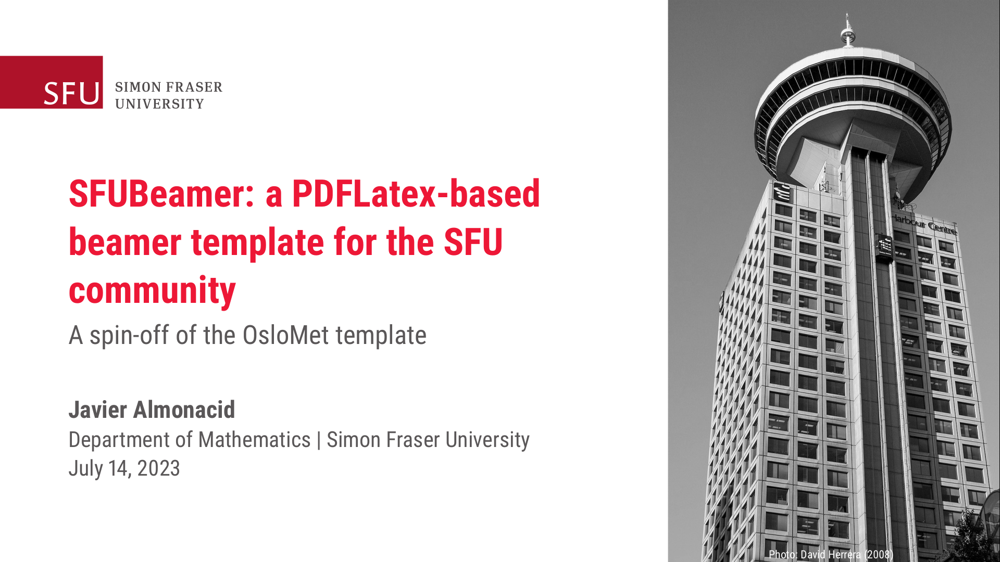

# SFUBeamer: a PDFLatex-based beamer template for the SFU community

This is a beamer (LaTeX) template that attempts to follow SFU's [branding guidelines](https://www.sfu.ca/communicators-toolkit/guides/brand-guide.html). It is meant to be compiled using the standard PDFLatex engine. It does not require Lualatex or Xelatex but it does require the [Roboto font package](https://ctan.org/pkg/roboto?lang=en).

This template/theme is based on the OsloMet template developed by Martin Helsø (https://github.com/martinhelso/OsloMet). Visit their website for more information on the commands available for this template.

Here is an example of what you can do with this template: my [MSc thesis defence](http://www.sfu.ca/~javiera/files/msc_defence.pdf).
